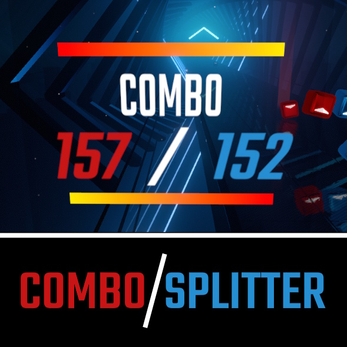

# ComboSplitter - For Beat Saber v1.38.0+
A simple mod for Beat Saber that shows the combo for each hand.

## Dependencies:
- BSIPA v4.3.5+
- SiraUtil v3.1.12+
- BeatSaberMarkupLanguage: v1.12.3+

## Usage
* Counts each individual hand's combo instead of a total combo for both
  * One saber maps will only show the active saber combo
* Option to follow the saber color scheme
  * *Can be disabled*
* Hover hint that shows how many cuts and misses each hand got when you hover over the total cut number
  * Options:
    * Follow the saber color scheme
    * Show hand percentage
    * Show total misses for each hand
    * Extend miss info (shows bad cuts, misses, and bomb hits individually)
  * *All can be disabled*
* Bad cuts and misses are properly tracked for each hand
* Sticking your head inside a wall resets both combos down to zero
* Works in standard levels as well as multiplayer!
